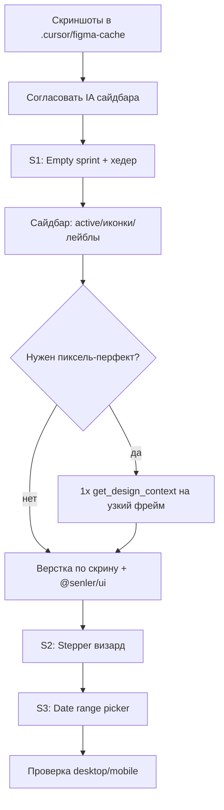

# Figma → admin-frontend: план внедрения (ready for dev)

> Обновлено: 2026-07-22  
> MCP: **3× `get_screenshot`** (по одному на ноду). `get_design_context` **не вызывался** — экономия лимитов.  
> Скриншоты: `.cursor/figma-cache/*.png`

## Источники

| Нода | URL | Скрин | Что это (по скриншоту) |
|------|-----|-------|------------------------|
| `15857:5091` | [Figma](https://www.figma.com/design/bAbFX4C4FHvWQ1whR5p3jn/Senler-%E2%80%93-Layouts?node-id=15857-5091&m=dev) | `15857-5091.png` | **Спринты**: empty state + шаг 1 создания (степпер) |
| `15593:39086` | [Figma](https://www.figma.com/design/bAbFX4C4FHvWQ1whR5p3jn/Senler-%E2%80%93-Layouts?node-id=15593-39086&m=dev) | `15593-39086.png` | Широкий артборд (несколько экранов Senler/онбординг-паттерны) |
| `16054:51631` | [Figma](https://www.figma.com/design/bAbFX4C4FHvWQ1whR5p3jn/Senler-%E2%80%93-Layouts?node-id=16054-51631) | `16054-51631.png` | **Сайдбар** Ambassadar |

fileKey: `bAbFX4C4FHvWQ1whR5p3jn`

---

## 1. Сайдбар (`16054:51631`) — фундамент

### Макет (пункты сверху вниз)

1. Шапка: аватар/лого + название компании («StreamVi promo») + переключатель
2. Строка «Токены» + баланс
3. Навигация:
   - Уведомления (бейдж)
   - **Спринт** (active: синий фон, белый текст)
   - Индивидуальные задания
   - Награды
   - Аналитика
   - Участники
   - Профиль ОРД
4. Низ: блок «Создаем бота…» / help

### Сейчас в коде

`src/pages/(list_integration)/modules/index.tsx` → `AppShell` из `@senler/ui`:

- Настройки, Спринты, Награды, События, Задачи, Приглашения, ОРД, Заявки, Статистика, Код для сайта

### Gap

| Макет | Код | Действие |
|-------|-----|----------|
| Токены в шапке | нет | продуктовое решение + API |
| Уведомления + бейдж | нет | продуктовое решение + API |
| Спринт | есть «Спринты» | визуал active-state |
| Индивидуальные задания | есть «Задачи» / private | переименовать + маршруты |
| Награды | есть | ок |
| Аналитика | «Статистика» | лейбл / объединить |
| Участники | «Заявки»? | уточнить у дизайна/продукта |
| Профиль ОРД | раздел ОРД | упростить до одного пункта? |
| События / Приглашения / Код / Настройки | есть в коде, нет в этом сайдбаре | не удалять без решения |

### План работ (сайдбар)

1. **Только визуал** (без смены IA): стили active item, отступы, иконки, бейдж-слот.
2. **Согласовать карту пунктов** (см. вопрос ниже).
3. После согласования — переименовать/переставить `navigation` в `modules/index.tsx`.
4. Шапка компании + токены — отдельный этап (нужны данные с бэка).

**Файлы:** `modules/index.tsx`, возможно кастомный слот AppShell header/footer.

---

## 2. Спринты (`15857:5091`) — основной экран ready-for-dev

### Макет A — Empty state

- Заголовок «Спринт» / «Спринты»
- Текст: «Спринт еще не добавлен. Создайте задания…»
- CTA «+ Добавить» (в шапке и в центре)

### Макет B — Создание, шаг 1 «Настройки спринта»

- Степпер: **1. Настройки** → 2. Вознаграждение → 3. Задания
- «Сохранить черновик»
- Поля: Название, Описание, Продолжительность (range calendar May–June style)
- Кнопка «Продолжить»

### Сейчас в коде

- Список: `sprints/index.tsx` + `SprintsEmptyState`
- Создание: сразу форма на `/sprints/new` (настройки + промокоды + reward rules), **без степпера**
- Нет dual-month date range picker как в макете
- Нет шагов «Вознаграждение» / «Задания» в визарде

### Gap / продуктовые решения

| Макет | Код | Нужно решение |
|-------|-----|----------------|
| 3-шаговый визард | одна длинная форма | **новый UX** vs только стили |
| Описание спринта | есть `name`, нет явного description? | проверить API Sprint DTO |
| Вознаграждение как шаг 2 | reward rules + старые rewardUnits | связать с каталогом наград |
| Задания как шаг 3 | креативные задачи отдельно | привязка задач к спринту? (нет в API?) |

### План работ (спринты) — рекомендуемый порядок

**Этап S1 — визуал без смены флоу (безопасно)**  
- Empty state по макету (тексты, кнопки, desktop/mobile)  
- Хедер списка «Спринт» + «+ Добавить»  
- Не ломает API  

**Этап S2 — степпер UI поверх текущей формы**  
- Компонент Stepper (1–3)  
- Шаг 1: name / dates (и description, если есть в API)  
- Шаг 2: существующий блок наград/промокодов + reward rules  
- Шаг 3: пока заглушка или ссылка на задачи комнаты — **если нет API связи sprint↔tasks**  

**Этап S3 — date range picker**  
- Dual calendar как в Figma  
- Адаптировать под `startDate` / `endDate` / `ignoreEndDate`  

**Этап S4 — get_design_context только для S1–S3**  
- 1–2 вызова MCP на конкретные фреймы (empty + form step), не на весь артборд  

---

## 3. Нода `15593:39086` — уточнение

Скрин — **очень широкий** артборд (~8990px). По кадру видны экраны вроде «Создание рассылки / чат-бота / проекта» (Senler-паттерны), плюс billing/лимиты.

Ранее по этой же ноде в кэше описывали **Welcome Ambassadar** (уже сделано: `RoomsWelcome`, `CreateCompanyForm`, тариф/оплата).

**Вывод:** не тратить MCP на весь `15593:39086`. Перед разработкой нужно:

- либо прислать **дочерние node-id** конкретных фреймов Ambassadar,  
- либо скрин нужного подфрейма в чат.

---

## 4. Общий флоу внедрения стилей (минимум MCP)

### Правило по MCP

| Когда | Что вызывать |
|-------|----------------|
| Планирование / сверка | только `get_screenshot` (уже есть) |
| Кодинг одного экрана | **1×** `get_design_context` на **дочерний** frame, не на весь section |
| Повтор | читать `.cursor/figma-cache`, не дёргать MCP |
| Токены/variables | `get_variable_defs` — максимум 1 раз на файл, закэшировать |

### Стек стилей

- Не копировать Tailwind из MCP as-is  
- Переиспользовать `@senler/ui` (`Button`, `InputField`, `AppShell`, `Card`…)  
- Цвета/радиусы — токены senler-ui (`primary`, `muted`, `border`)  
- Терминология: UI «компания» = код `room`

---

## 5. Предлагаемый порядок спринтов разработки

1. **Sidebar visual pass** (active state + иконки) — быстро, видно сразу  
2. **Sprints empty + list header** по `15857:5091`  
3. **Согласование 3-step create** (продукт: есть ли API для шага «Задания»?)  
4. **Stepper + split формы**  
5. **Date range UI**  
6. Уточнить `15593:39086` дочерними ссылками  

---

## Вопросы перед кодом

1. Сайдбар: перестраиваем IA под макет (убираем/прячем События, Код, Настройки из меню) или только стилизуем текущие пункты?  
2. Создание спринта: делаем настоящий 3-шаговый визард или пока только empty + косметика текущей формы?  
3. Для `15593:39086` — какие именно подфреймы Ambassadar нужны (пришлите node-id или скрин)?  
